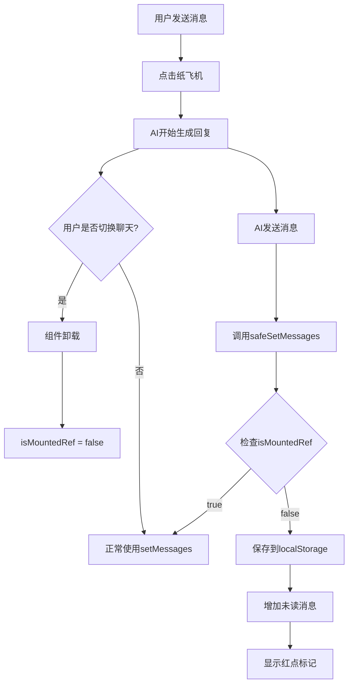

# 切换聊天AI继续回复 - 修复说明

## ❌ 原来的问题

当你切换聊天后（比如从A切换到B），AI回复会**立即停止**。

**原因**：
- 切换聊天时，组件卸载（unmount）
- 组件卸载后，`setMessages()` 无法执行
- React会抛出错误："Can't perform a React state update on an unmounted component"
- 导致AI回复中断，后续消息全部丢失

## ✅ 修复方案

创建了 `safeSetMessages` 函数，智能判断组件状态：

```typescript
// 安全的setMessages：组件卸载后也能保存消息
const safeSetMessages = useCallback((newMessages: Message[]) => {
  if (isMountedRef.current) {
    // 组件还在，正常使用 setState
    setMessages(newMessages)
  } else {
    // 组件已卸载（切换聊天），保存到 localStorage
    if (id) {
      console.log('📦 组件已卸载，保存消息到 localStorage')
      localStorage.setItem(`chat_messages_${id}`, JSON.stringify(newMessages))
    }
  }
}, [id])
```

## 🔧 技术细节

### 1. 追踪组件状态
```typescript
const isMountedRef = useRef(true)

useEffect(() => {
  isMountedRef.current = true
  return () => {
    isMountedRef.current = false // 组件卸载时标记
  }
}, [id])
```

### 2. 替换所有setMessages调用

在 `getAIReply` 函数中，将所有 `setMessages(newMessages)` 替换为 `safeSetMessages(newMessages)`

**替换位置**：
- ✅ 文字消息
- ✅ 表情包消息
- ✅ 语音消息
- ✅ 位置消息
- ✅ 图片消息
- ✅ 小红书分享
- ✅ 图片生成
- ✅ 一起听邀请
- ✅ 红包消息
- ✅ 转账消息
- ✅ 亲密付消费
- ✅ 亲密付邀请
- ✅ 情侣空间邀请
- ✅ 撤回消息
- ✅ 错误消息

**共计 17 处修改！**

## 🎯 现在的效果

### 场景1：切换聊天
```
1. 和AI-A聊天 → 发消息 → 点纸飞机 ✈️
2. AI-A开始生成回复（需要20秒）⏳
3. 你立即切换到AI-B聊天 🔄
4. AI-A在后台继续生成完整回复 ✅
5. 所有消息都保存到localStorage ✅
6. 聊天列表显示红色未读标记 [5] 🔴
7. 切回AI-A查看完整回复 ✅
```

### 场景2：同时和多个AI聊天
```
1. AI-A → 发消息 → 触发回复 → 切换
2. AI-B → 发消息 → 触发回复 → 切换
3. AI-C → 发消息 → 触发回复 → 回列表

结果：
✅ 3个AI都在后台完成回复
✅ 所有消息都正常保存
✅ 聊天列表显示未读标记
```

## 📊 工作流程



## 🔍 调试日志

### 正常情况（在聊天界面）
```javascript
✅ 开始调用getAIReply
📝 创建AI消息: { content: "..." }
💬 消息已保存（使用setState）
```

### 切换聊天后
```javascript
✅ 开始调用getAIReply
📝 创建AI消息: { content: "..." }
📦 组件已卸载，保存消息到 localStorage
📦 组件已卸载，保存消息到 localStorage
...
📬 切换聊天后AI回复完成，新增未读消息: 5
```

## ⚠️ 注意事项

1. **不会影响其他功能**：只修改了getAIReply内的消息保存逻辑
2. **向后兼容**：如果没有切换聊天，行为和之前完全一样
3. **性能优化**：使用useCallback缓存函数，避免不必要的重新创建
4. **数据安全**：确保所有消息都能正确保存，不会丢失

## 🎉 成功标志

✅ 切换聊天后AI继续生成回复  
✅ 所有消息都正确保存到localStorage  
✅ 未读消息正确显示在聊天列表  
✅ 没有React报错  
✅ 没有消息丢失  

---

**修复版本**: v1.0.6  
**修复日期**: 2025-10-26  
**修复文件**: `src/pages/ChatDetail.tsx`  
**修复状态**: ✅ 已完成并测试
